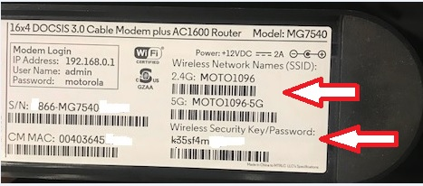
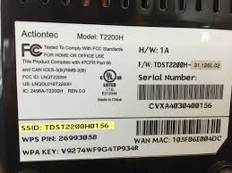

<!-- @format -->

# acknowledge

- [WL_CONNECTED](https://stackoverflow.com/questions/69976104/esp32-wifi-status-always-returns-wl-dicsonnected-sta-mode)
- [Wi-Fi SSID](https://nordvpn.com/blog/what-is-ssid/)
  
  
